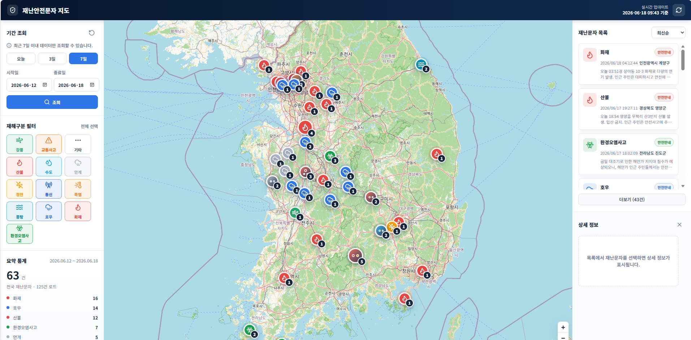

# 재난안전문자 지도

재난안전문자 데이터를 지도와 목록으로 함께 보여주는 대시보드입니다.  
국내 재난안전문자 공공 API를 불러와 지역별로 묶고, 유형과 심각도를 같이 확인할 수 있습니다.

## 주요 기능

- 기간별 재난안전문자 조회
- 오늘 / 3일 / 7일 빠른 기간 선택
- 재난 유형 필터링
- 지역명 검색
- 정렬 방식 변경
- 지도 마커와 상세 목록 동시 표시
- 지역별 팝업과 메시지 상세 패널
- API 실패 시 샘플 데이터로 대체 표시

## 실행 방법

로컬에서는 `server.py`를 실행한 뒤 사용하는 구성을 권장합니다.

```bash
python server.py
```

브라우저에서 아래 주소를 열면 됩니다.

```text
http://127.0.0.1:8000
```

## 구성 파일

- `index.html` - 화면 구조와 외부 라이브러리 연결
- `styles.css` - 전체 UI 스타일
- `app.js` - 데이터 조회, 필터링, 지도 렌더링, 상호작용 로직
- `server.py` - 공공 API 프록시와 지역 지오코딩 프록시

## 동작 방식

`app.js`는 재난안전문자 공공 API에서 데이터를 받아옵니다.  
로컬 서버가 실행 중이면 `server.py`의 `/api/messages` 프록시를 우선 사용하고,  
직접 파일로 열었을 때는 공공 API를 직접 호출합니다.

지역 좌표가 필요한 경우 `server.py`의 `/api/geocode`를 통해 OpenStreetMap Nominatim으로 지오코딩합니다.

## 사용 기술

- HTML
- CSS
- Vanilla JavaScript
- Leaflet
- Lucide Icons
- Python `http.server`

## 참고

- 조회 기간은 최대 7일로 제한됩니다.
- 공공 API 연결에 실패하면 화면에 샘플 데이터가 표시됩니다.
- 지도와 목록은 서로 연동되어 있어 마커를 클릭하면 해당 지역의 메시지를 확인할 수 있습니다.
